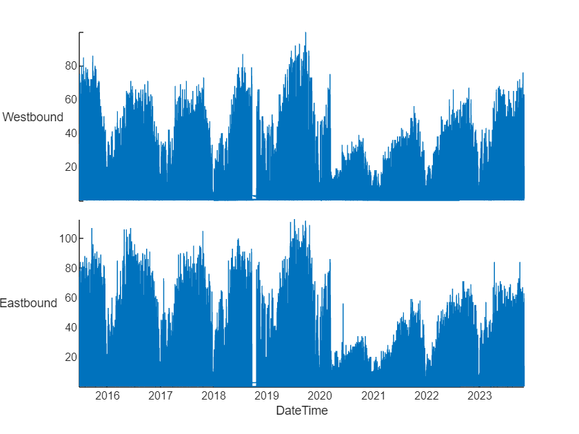
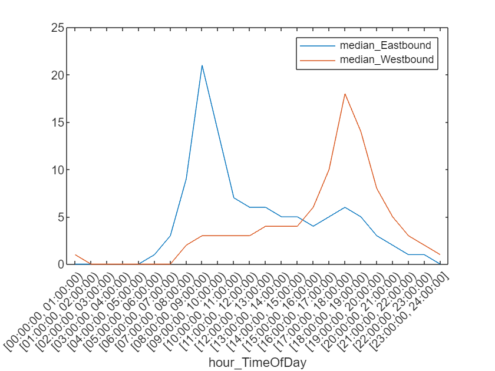

# 12 software engineering hacks for your MATLAB experience
## New Data Types
### strings

Imagine that you're teaching a course of students, and you want to manage the class list in MATLAB


Historically, you might use a combination of character arrays and cell arrays...

```matlab
CourseStudentNames = {...
    'Alessandro','Rossi';...
    'Wang', 'Li';...
    'Devi', 'Singh';...
    'María', 'García';...
    'Adebayo', 'Oluwafemi';...
    'João', 'Silva'}
```

```TextOutput
CourseStudentNames = 6x2 cell    
'Alessandro' 'Rossi'      
'Wang'       'Li'         
'Devi'       'Singh'      
'María'      'García'     
'Adebayo'    'Oluwafemi'  
'João'       'Silva'      
```

These were commonly referred to as "cell strings" Strings, introduced in R2016 are much easier to use and manage, and provide a lot more functionality.  Use a double quote, rather than a single quote, and you can put them right into an array:

```matlab
  CourseStudentNames = [...
    "Alessandro","Rossi";...
    "Wang", "Li";...
    "Devi", "Singh";...
    "María", "García";...
    "Adebayo", "Oluwafemi";...
    "João", "Silva"]
```

```TextOutput
CourseStudentNames = 6x2 string    
"Alessandro" "Rossi"      
"Wang"       "Li"         
"Devi"       "Singh"      
"María"      "García"     
"Adebayo"    "Oluwafemi"  
"João"       "Silva"      
```

Manipulating strings is much easier and intuitive than cell arrays of chars

```matlab
FirstName = CourseStudentNames(:,1);
LastName = CourseStudentNames(:,2);
FullName = FirstName + " " + LastName
```

```TextOutput
FullName = 6x1 string    
"Alessandro Ro…  
"Wang Li"        
"Devi Singh"     
"María García"   
"Adebayo Oluwa…  
"João Silva"     
```

In R2020b, a set of powerful text parsing and pattern matching tools were introduced.  Here's just quick taste of what you can do.  Imagine, for fun, you wanted to chose the order of class presentations by the number of vowels a student's name had:

```matlab
FullName
```

```TextOutput
FullName = 6x1 string    
"Alessandro Ro…  
"Wang Li"        
"Devi Singh"     
"María García"   
"Adebayo Oluwa…  
"João Silva"     
```

```matlab
VowelCount = count(FullName,...
    characterListPattern("aãeiíou"))
```

```TextOutput
VowelCount = 6x1    
     5
     2
     3
     6
     7
     5
```
## table

How do you keep track of related data that have different types?  Historically, you could use struct, but there's a lot of messiness there when you want to work with a lot of data.  

```matlab
course = struct("FirstName",cellstr(FirstName),...
    "LastName",cellstr(LastName))
```
|Fields|FirstName|LastName|
|:--:|:--:|:--:|
|1|'Alessandro'|'Rossi'|
|2|'Wang'|'Li'|
|3|'Devi'|'Singh'|
|4|'María'|'García'|
|5|'Adebayo'|'Oluwafemi'|
|6|'João'|'Silva'|


tables, introduced in R2013b with significant performance increases in R2019b, are a natural way to manage tabular data of different types:

```matlab
course = table(FirstName,LastName)
```
| |FirstName|LastName|
|:--:|:--:|:--:|
|1|"Alessandro"|"Rossi"|
|2|"Wang"|"Li"|
|3|"Devi"|"Singh"|
|4|"María"|"García"|
|5|"Adebayo"|"Oluwafemi"|
|6|"João"|"Silva"|


Let's add our number of vowels and find out who's presenting first:

```matlab
course
```
| |FirstName|LastName|
|:--:|:--:|:--:|
|1|"Alessandro"|"Rossi"|
|2|"Wang"|"Li"|
|3|"Devi"|"Singh"|
|4|"María"|"García"|
|5|"Adebayo"|"Oluwafemi"|
|6|"João"|"Silva"|

```matlab
course.NumberOfVowels = VowelCount;
sortrows(course,"NumberOfVowels","descend")
```
| |FirstName|LastName|NumberOfVowels|
|:--:|:--:|:--:|:--:|
|1|"Adebayo"|"Oluwafemi"|7|
|2|"María"|"García"|6|
|3|"Alessandro"|"Rossi"|5|
|4|"João"|"Silva"|5|
|5|"Devi"|"Singh"|3|
|6|"Wang"|"Li"|2|


Adebayo is going to be first!

### Datetime and Duration

Historically, MATLAB managed time information using datenum, which was a numeric value tied to the calendar.   

```matlab
dueDate = datenum("2023-11-22 23:59:00")
```

```TextOutput
dueDate = 7.3921e+05
```

In R2014b, datetime and duration were added, which include powerful functions for managing timestamps across timezones.  Let's imagine we have a paper that's due at 11:59 on November 22.  How much time is left? 

```matlab
dueDate = datetime("2023-11-22 23:59:00")
```

```TextOutput
dueDate = 
   22-Nov-2023 23:59:00
```

```matlab
dueDate - datetime("now")
```

```TextOutput
ans = 
   150:58:42
```

datetimes represent a specific date and time, durations represent a span of time between two dates, usually shown in hours:


Actually, it's an online class, and the students are from around the world.  Our deadline is Central European time, but the students submitted their work all over the world in different time zones -- did they make it?

```matlab
dueDate.TimeZone = "Europe/Rome";
```


 Let's add a a record of when people submitted in their local time zone to each student

```matlab
course.PaperSubmitted = [...
    datetime("2023-11-22 03:00", "TimeZone","Europe/Rome");...
    datetime("2023-11-23 06:00", "TimeZone","Asia/Hong_Kong");...
    datetime("2023-11-22 20:00", "TimeZone","Asia/Calcutta");...
    datetime("2023-11-22 20:00", "TimeZone","Europe/Madrid");...
    datetime("2023-11-23 00:30", "TimeZone","Africa/Harare");...
    datetime("2023-11-22 21:00", "TimeZone","America/Sao_Paulo")]
```
| |FirstName|LastName|NumberOfVowels|PaperSubmitted|
|:--:|:--:|:--:|:--:|:--:|
|1|"Alessandro"|"Rossi"|5|22-Nov-2023 03:00:00|
|2|"Wang"|"Li"|2|22-Nov-2023 23:00:00|
|3|"Devi"|"Singh"|3|22-Nov-2023 15:30:00|
|4|"María"|"García"|6|22-Nov-2023 20:00:00|
|5|"Adebayo"|"Oluwafemi"|7|22-Nov-2023 23:30:00|
|6|"João"|"Silva"|5|23-Nov-2023 01:00:00|


Note that MATLAB automatically converted everything to the same time zone so we can easily compare them

```matlab
course.OnTime = course.PaperSubmitted < dueDate
```
| |FirstName|LastName|NumberOfVowels|PaperSubmitted|OnTime|
|:--:|:--:|:--:|:--:|:--:|:--:|
|1|"Alessandro"|"Rossi"|5|22-Nov-2023 03:00:00|1|
|2|"Wang"|"Li"|2|22-Nov-2023 23:00:00|1|
|3|"Devi"|"Singh"|3|22-Nov-2023 15:30:00|1|
|4|"María"|"García"|6|22-Nov-2023 20:00:00|1|
|5|"Adebayo"|"Oluwafemi"|7|22-Nov-2023 23:30:00|1|
|6|"João"|"Silva"|5|23-Nov-2023 01:00:00|0|


Sorry, João -- even though you submitted before the deadline in local time, the deadline has already passed.

### timetable
```matlab
load BicycleCounts.mat
bikeData
```
| |DateTime|Westbound|Eastbound|Weekday|
|:--:|:--:|:--:|:--:|:--:|
|1|18-Jan-2022 00:00:00|0|0|Tuesday|
|2|18-Jan-2022 00:15:00|0|0|Tuesday|
|3|18-Jan-2022 00:30:00|0|0|Tuesday|
|4|18-Jan-2022 00:45:00|0|0|Tuesday|
|5|18-Jan-2022 01:00:00|0|0|Tuesday|
|6|18-Jan-2022 01:15:00|0|0|Tuesday|
|7|18-Jan-2022 01:30:00|0|0|Tuesday|
|8|18-Jan-2022 01:45:00|0|0|Tuesday|
|9|18-Jan-2022 02:00:00|0|0|Tuesday|
|10|18-Jan-2022 02:15:00|1|0|Tuesday|
|11|18-Jan-2022 02:30:00|0|0|Tuesday|
|12|18-Jan-2022 02:45:00|0|0|Tuesday|
|13|18-Jan-2022 03:00:00|0|0|Tuesday|
|14|18-Jan-2022 03:15:00|0|0|Tuesday|

```matlab
stackedplot(bikeData)
```



```matlab
bikeData.TimeOfDay = timeofday(bikeData.DateTime);
```

```matlab
% Compute group summary
averageDay = groupsummary(bikeData,"TimeOfDay","hour","median",vartype("numeric"));
averageDay.GroupCount = []
```
| |hour_TimeOfDay|median_Westbound|median_Eastbound|
|:--:|:--:|:--:|:--:|
|1|[00:00:00, 01:00:00)|1|0|
|2|[01:00:00, 02:00:00)|0|0|
|3|[02:00:00, 03:00:00)|0|0|
|4|[03:00:00, 04:00:00)|0|0|
|5|[04:00:00, 05:00:00)|0|0|
|6|[05:00:00, 06:00:00)|0|1|
|7|[06:00:00, 07:00:00)|0|3|
|8|[07:00:00, 08:00:00)|2|9|
|9|[08:00:00, 09:00:00)|3|21|
|10|[09:00:00, 10:00:00)|3|14|
|11|[10:00:00, 11:00:00)|3|7|
|12|[11:00:00, 12:00:00)|3|6|
|13|[12:00:00, 13:00:00)|4|6|
|14|[13:00:00, 14:00:00)|4|5|

```matlab
plot(averageDay,"hour_TimeOfDay",["median_Eastbound","median_Westbound"]) 
legend
```


## Reliability
### function blocks

Let's go back to our class.  They took their first test, and it didn't really go well

```matlab
Test1Raw = [78;86;72;88;74;67];
course = table(FirstName,LastName,Test1Raw);
course
```
| |FirstName|LastName|Test1Raw|
|:--:|:--:|:--:|:--:|
|1|"Alessandro"|"Rossi"|78|
|2|"Wang"|"Li"|86|
|3|"Devi"|"Singh"|72|
|4|"María"|"García"|88|
|5|"Adebayo"|"Oluwafemi"|74|
|6|"João"|"Silva"|67|

```matlab
cd applyCurveV1
```

The professor decides to apply a simple curve, and writes a function to do it:


 

```matlab
type applyCurve.m
```

```TextOutput
function curvedGrade = applyCurve(grade)
    curvedGrade = grade + (85 - median(grade,1));
end
```

```matlab
applyCurve(course.Test1Raw)
```

```TextOutput
ans = 6x1    
    87
    95
    81
    97
    83
    76
```

Works great!  But the skill I want you all to cultivate is the nasty, cynical, bad person who asks “what if” – and tries to break things.  For example, our little function goes terribly wrong if you pass in a horizontal vector.

```matlab
applyCurve(course.Test1Raw')
```

```TextOutput
ans = 1x6    
    85    85    85    85    85    85
```

```matlab
cd ..\applyCurveV2
```

Time for validation.  We add an argument block, and specify that the grade parameter must be a vertical vector of doubles:

```matlab
type applyCurve.m
```

```TextOutput
function curvedGrade = applyCurve(grade)
    arguments
        grade (:,1) double
    end
    curvedGrade = grade + (85 - median(grade,1));
end
```

Suddenly, everything works better -- because it not only checks to see if the inputs are valid, but it attempts to put them in the right format if it can:


The horizontal vector from earlier is fixed

```matlab
applyCurve(course.Test1Raw')
```

```TextOutput
ans = 6x1    
    87
    95
    81
    97
    83
    76
```

If we pass in something that can be converted to double, it is

```matlab
applyCurve(["10","20","30"])
```

```TextOutput
ans = 3x1    
    75
    85
    95
```

Even fairly esoteric things, like hexidecimal numbers.... did you know that MATLAB does that?

```matlab
applyCurve([0x23 0x35])
```

```TextOutput
ans = 2x1    
    76
    94
```

```matlab
cd ..\applyCurveV3

applyCurve(course.Test1Raw)
```

```TextOutput
ans = 6x1    
    87
    95
    81
    97
    83
    76
```

```matlab
applyCurve(course.Test1Raw,87.5)
```

```TextOutput
ans = 6x1    
   89.5000
   97.5000
   83.5000
   99.5000
   85.5000
   78.5000
```

```matlab
cd ..
```
